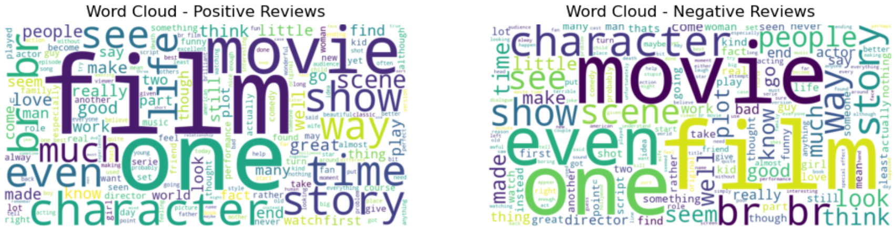
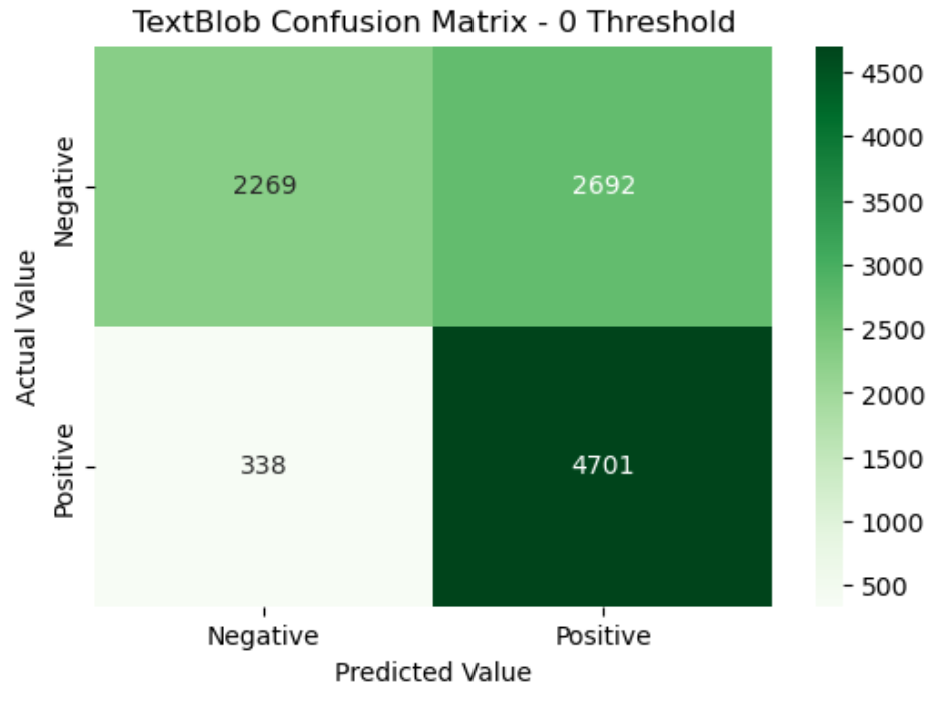
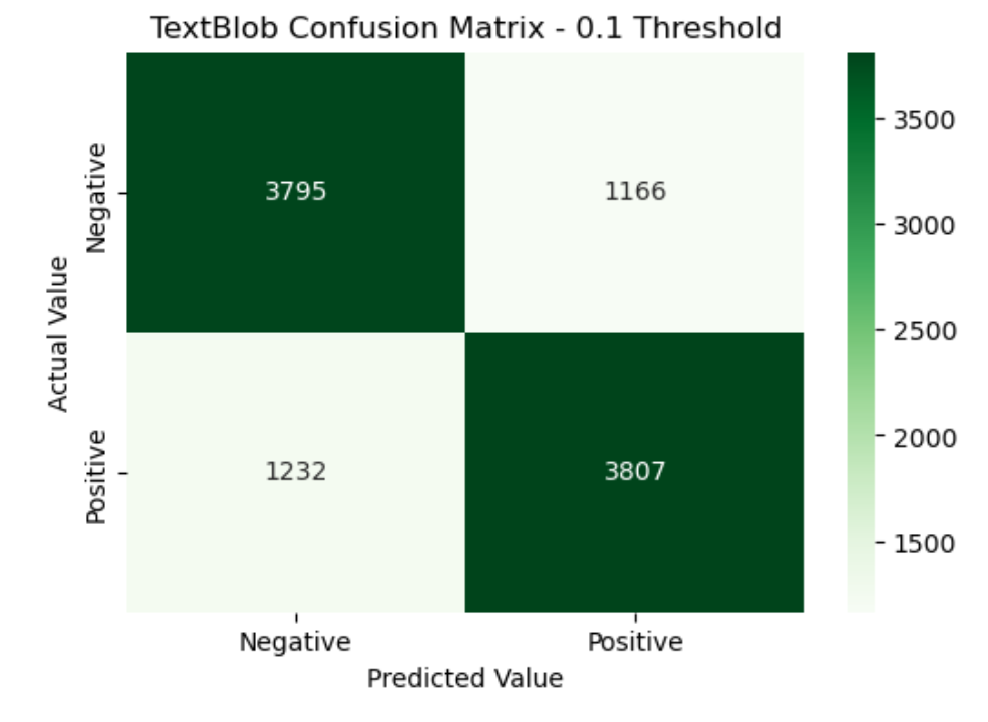
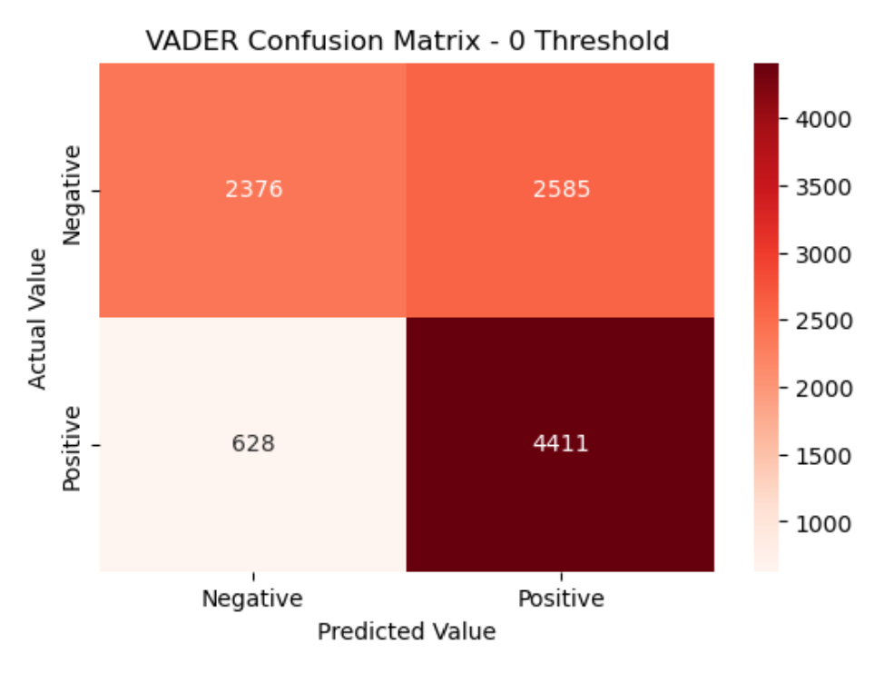
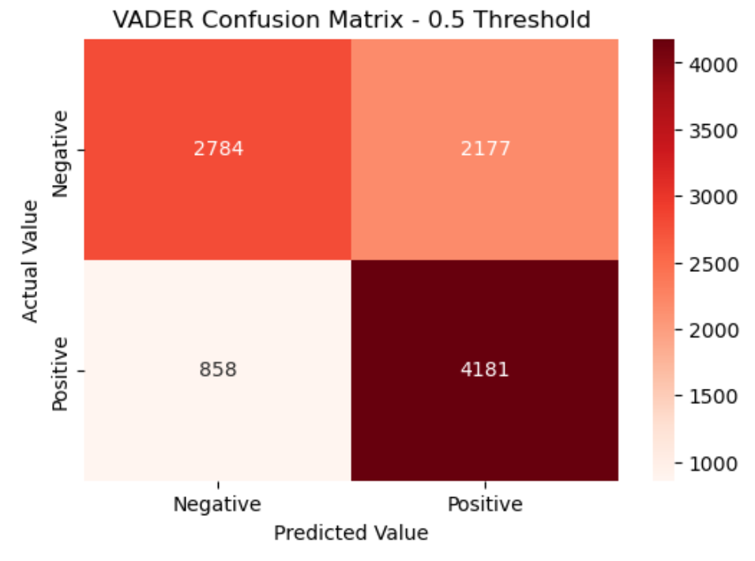

# 🎬 IMDb Sentiment Analysis Using TextBlob & VADER

This project performs sentiment analysis on 50,000 IMDb movie reviews using two popular NLP tools: **TextBlob** and **VADER**. The goal is to classify reviews as **positive** or **negative**, compare both tools, and experiment with threshold tuning to improve performance.

> ✅ This project was submitted as part of my MSc in Data Science coursework.

---

## 📁 Repository Structure

```
.
├── data/                # IMDb dataset
│
├── notebook/            
│   ├── sentiment_analysis.ipynb
│   └── images/          # Word clouds & confusion matrices
│       ├── cm_textblob_0_thr.png
│       ├── cm_textblob_0.1_thr.png
│       ├── cm_vader_0_thr.png
│       ├── cm_vader_0.5_thr.png
│       └── word_cloud.png
```

---

## 📊 Dataset

- **Source:** [IMDb Dataset of 50K Movie Reviews](https://www.kaggle.com/datasets/lakshmi25npathi/imdb-dataset-of-50k-movie-reviews)
- **Size:** 50,000 reviews, evenly split between positive and negative labels
- **Use case:** Binary sentiment classification

---

## 🧹 Preprocessing

- Removed punctuation, special characters, and stopwords
- Converted text to lowercase
- Tokenized the reviews
- Verified **balanced class distribution** (25k positive, 25k negative)

---

## ☁️ Word Cloud EDA

### Word Cloud - Positive vs Negative Reviews


Word clouds show frequent words in each sentiment group:
- **Positive reviews** use words like _"great"_, _"love"_, _"story"_, _"performance"_
- **Negative reviews** include terms like _"bad"_, _"worst"_, _"boring"_, _"waste"_

---

## 🧠 Sentiment Classification

Ι analyzed sentiment using both tools:

| Tool      | Default Threshold | Tuned Threshold | Accuracy (default) | Accuracy (tuned) |
|-----------|-------------------|------------------|---------------------|------------------|
| TextBlob  | `> 0`             | `> 0.1`          | 0.70                | **0.76**         |
| VADER     | `> 0`             | `> 0.5`          | 0.68                | **0.70**         |

---

### 📌 Threshold Tuning Insights

#### 🔹 TextBlob Confusion Matrices

### TextBlob Confusion Matrix (Threshold = 0)


### TextBlob Confusion Matrix (Threshold = 0.1)


- At **0 threshold**, many negative reviews are misclassified as positive.
- Raising the threshold to **0.1** significantly reduces false positives, improving accuracy.

#### 🔹 VADER Confusion Matrices

### VADER Confusion Matrix (Threshold = 0)


### VADER Confusion Matrix (Threshold = 0.5)


- At **0 threshold**, VADER favors predicting positives, missing many negatives.
- A stricter threshold of **0.5** balances predictions and improves recall for negatives.

---

## 📈 Evaluation Metrics

We used the following to assess model performance:

- **Accuracy**
- **Precision**
- **Recall**
- **F1-Score**
- **Confusion Matrix**

TextBlob yielded **higher overall accuracy and F1-score**, especially for negative reviews. VADER was slightly better at catching positives (high recall), but less consistent on negatives.

---

## 🧪 Tools & Libraries

- Python, Pandas, Numpy
- TextBlob, VADER
- NLTK (tokenization, stopwords)
- Matplotlib & Seaborn
- WordCloud
- scikit-learn (metrics, confusion matrix)

---

## 📜 License

MIT License

---

## 🙋‍♂️ Author

📧 Dimitris Zografos — MSc Data Science  
